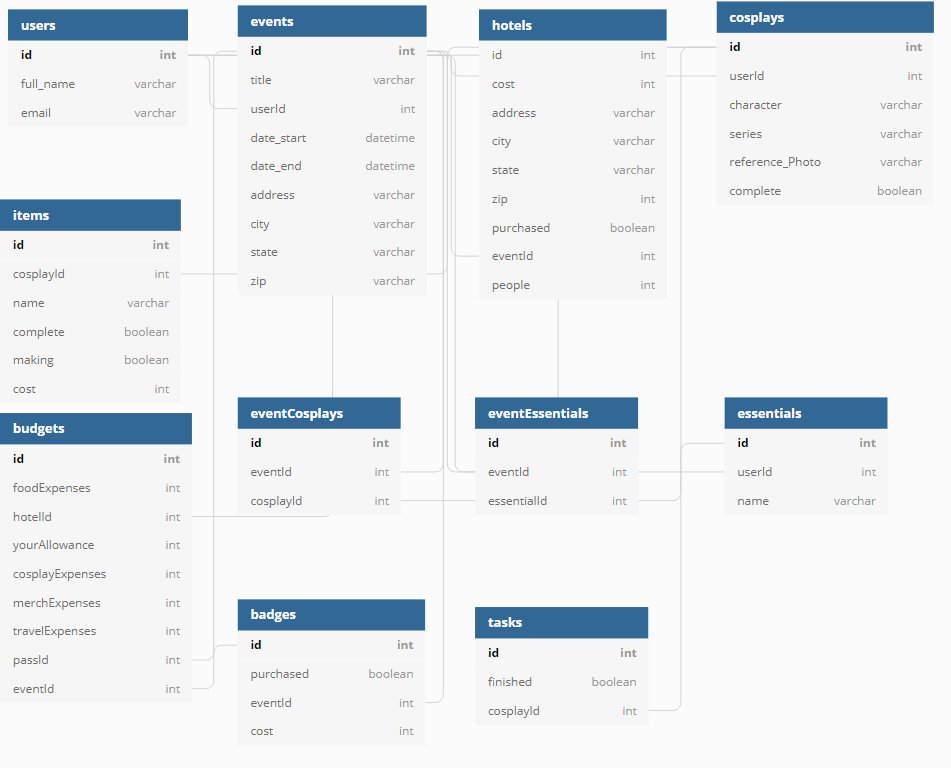

# Pros of Cons
An app for keeping track of conventions and what to pack!

Welcome to Pros of Cons!
Over my 10+ years of cosplaying, I've noticed there's a problem plaguing the community...
A problem so harsh, it can completely ruin an otherwise perfect weekend...

Forgetting what to pack!

Pros of Cons aims to eliminate this issue entirely!
In this app, each user can add their personal planned events, cosplays, and essential items that they never want to forget.
For each cosplay, a user can keep track of all the required pieces and their completion status, as well as a to-do list, so con crunch never becomes con-- oh no, I forgot to finish sewing my jacket!!
On top of that, each cosplay and essential item can be assigned to events to create a virtual packing list. Never forget your Naruto headband or deodorant again!

When viewing the details of a saved event, a user will be able to see and edit the following:
-Event location
-Their personal hotel stay
-Their personal budget
-Their personal packing list (cosplays with item list AND required essentials)

This project has been optimized for desktop AND mobile viewing!

To use Pros of Cons:
1. Copy this repository to your personal workspace.
2. Run npm install in the con-planner directory.
3. Create an API titled database.json with the following structure:
{
  "users": [],
  "items": [],
  "essentials": [],
  "events": [],
  "cosplays": [],
  "eventCosplays": [],
  "eventEssentials": [],
  "budgets": [],
  "tasks": []
}
4. Run json-server -p 8088 -w database.json at the location of said file.
5. In another terminal window, navigate to the con-planner directory and run npm start.
6. Sign up and get busy planning!

Please note that the login verification in this app is in no way how verification would work for a fully deployed app, as it is only mock verification used for locally hosted versions of this project. The app uses only front end development techniques, so no security measures are implemented.

The following images display my development techniques for this app.

Initial wireframe:

Entity Relationship Diagram:

Props and States for different components:
